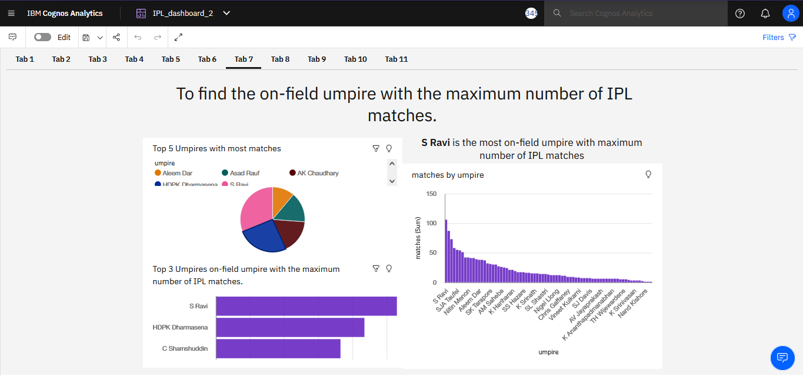
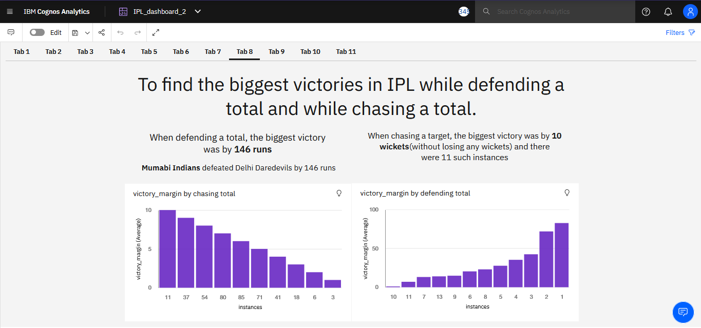
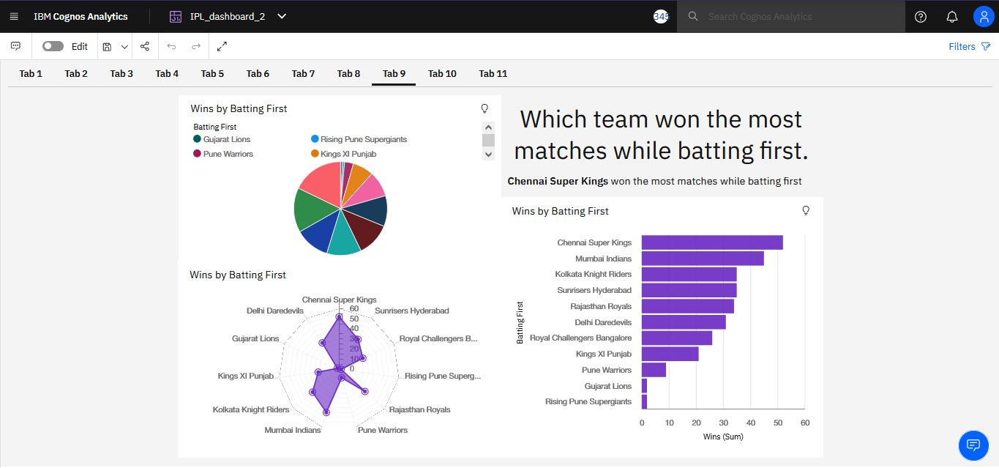
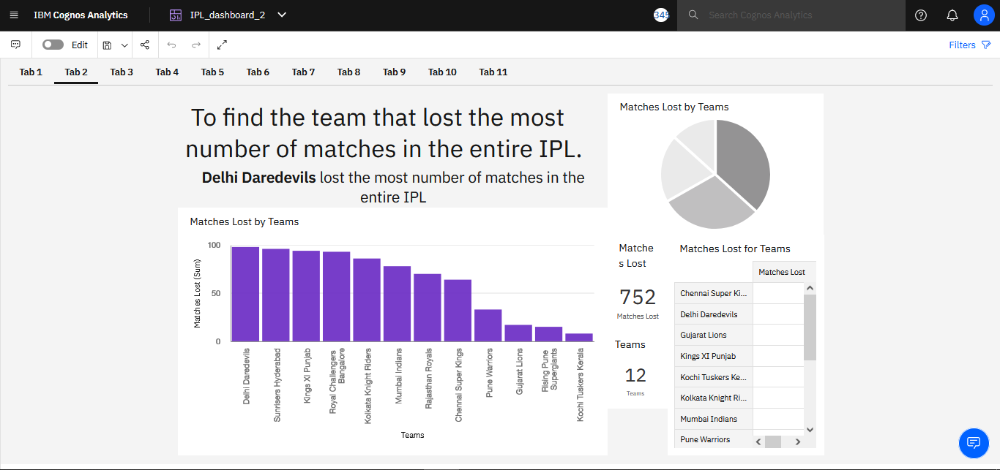
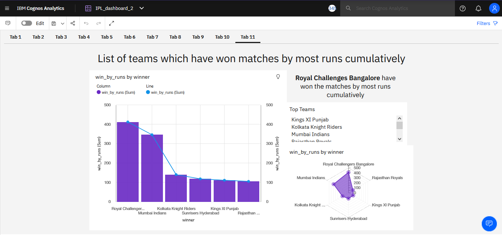
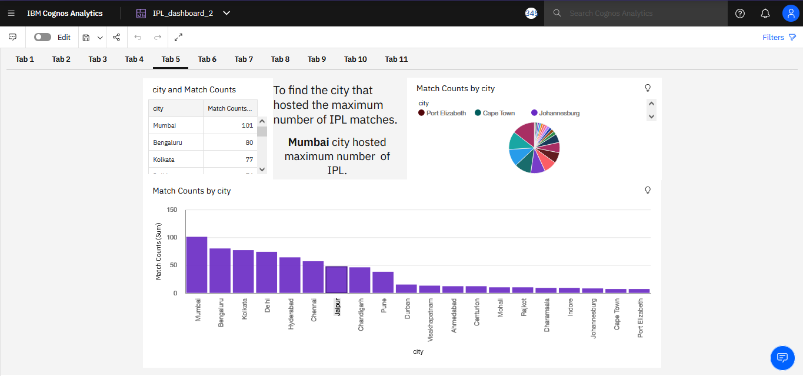

# SBSPS-Challenge-5230-Super-Predictor-of-Indian-Premier-League-IPL-

## We did Exploratory Data Analysis on [Indian Premier League Dataset](https://github.com/smartinternz02/SBSPS-Challenge-5230-Super-Predictor-of-Indian-Premier-League-IPL-/blob/master/matches-DATASET.csv), and extracted the important features from it.

# Using this extracted data file, we visualized the features and created a Dashboard
# Click here to open [Dashboard](https://github.com/smartinternz02/SBSPS-Challenge-5230-Super-Predictor-of-Indian-Premier-League-IPL-/blob/master/Dashboard.pdf)

<object data="Dashboard.pdf" type="application/pdf">
    <embed src="https://github.com/smartinternz02/SBSPS-Challenge-5230-Super-Predictor-of-Indian-Premier-League-IPL-/Dashboard.pdf">
        
Click here to <a href="https://github.com/smartinternz02/SBSPS-Challenge-5230-Super-Predictor-of-Indian-Premier-League-IPL-/raw/master/Dashboard.pdf">Download PDF</a>. 

    </embed>
</object>

<!-- https://drive.google.com/file/d/1XuPefzF9RePBK__5kADv1LM_mkC7sBAt/view?usp=sharing 1fGsW31LoHTwjjufiWmZYTuKTkY0TWLBw 
1ApGElz3Zc-Xu2U98qFbbxPQQjS1B48iA-->

# Dashboard Demo Video Click [Here](https://www.youtube.com/watch?v=kTsoTImxmhc)

# Objective
## &nbsp;&nbsp;&nbsp;&nbsp;&nbsp;&nbsp;&nbsp;&nbsp;&nbsp;&nbsp; The objective of this solution is to create dashboard that visualizes following capabilities and also forecast the future results 
# 1. To find the team that won the most number of matches in the entire IPL. 

# 2. To find the team that lost the most number of matches in the entire IPL. 

# 3. Does winning a toss increase the chances of victory.

# 4. To find the player with the most player of the match awards. 

# 5. To find the city that hosted the maximum number of IPL matches. 

# 6. To find the most winning team for each season. 

# 7. To find the on-field umpire with the maximum number of IPL matches. 

# 8. To find the biggest victories in IPL while defending a total and while chasing a total. 

# 9. Which team won the most matches while batting first. 

# 10. Which team won the most matches while batting second. 

# 11. List of teams which have won matches by most runs cumulatively 

# Team Members
### :octocat:[Prasanth A R](https://github.com/ptech12)
### :octocat:[Venkatesh E](https://github.com/venkatesh-jacke)
